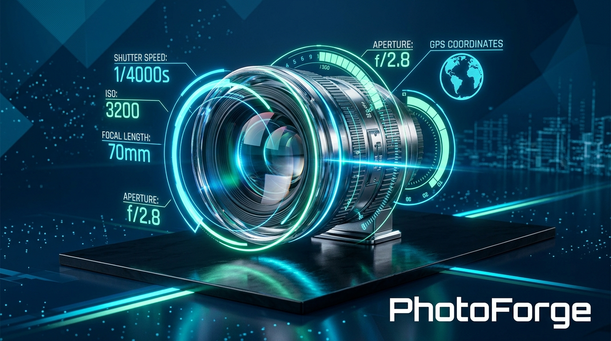
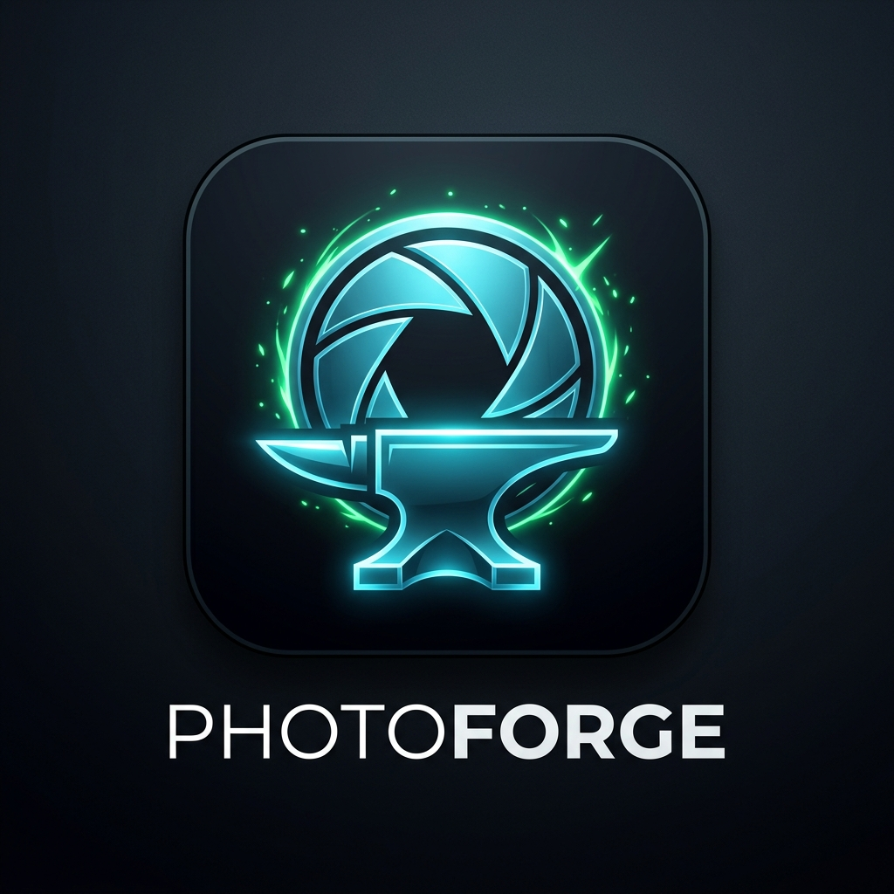

<p align="center">
  
</p>

<p align="center">
  
</p>

<p align="center">
  <strong>Offline-first Photo Metadata Continuity & Modern Format Conversion Platform for Windows & Android</strong>
</p>

<p align="center">
  <em>Edit freely. Keep everything.</em>
</p>

---

## 🌟 Overview

When photos are edited in popular software (Lightroom, Photoshop, mobile editors, social media tools) or saved as exports, crucial provenance and capture metadata is routinely stripped or degraded:
- Original camera make & model, lens specifications, and serial numbers
- Precise exposure settings (shutter speed, aperture, ISO, focal length)
- Original capture timestamp and subsecond timing
- GPS coordinates and altitude
- Original color profiles and maker notes

**PhotoForge** solves photo metadata loss by linking edited photos back to their originals through deterministic multi-signal candidate matching and restoring capture provenance without touching original camera files.

---

## 🚀 Key Features

- **🛡️ 100% Original Immutability (`INV-01`):** Camera originals are opened in strictly read-only mode with pre/post SHA-256 integrity verification.
- **⚡ Deterministic Multi-Signal Matching:** Combines filename edit distance, capture timestamps, aspect ratios, surviving EXIF remnants, perceptual visual hashing (64-bit dHash), and folder hierarchies.
- **🔒 Privacy Control for GPS:** Configurable policies: `KeepExact`, `Remove`, `Round` (1km precision), or `CopyWithWarning`.
- **🔁 Strict Idempotency & Markers (`INV-02`):** Injects standard-compliant, namespaced migration markers (`pf:PhotoForgeMigration`) to prevent redundant re-processing.
- **🔍 Independent Post-Write Verification (`INV-03`):** Every written file is independently re-read from disk to confirm EXIF, GPS, and image integrity before final commit.
- **💎 Modern Format Studio:** Lossless and high-efficiency HEIC and WebP conversion with complete metadata continuity.
- **🖥️ Native Windows Fluent UI:** Modern WPF application with dark Fluent theme, interactive Diff Inspector, drag-and-drop restore, and batch management.
- **💻 Cross-Platform CLI Tool:** Full-featured command-line utility with rich terminal UI and machine-readable `--json` output.
- **🗂️ Windows File Explorer Integration:** Right-click context menu integration for instantaneous restoration.
- **📱 Android Architecture Layer:** Scoped storage bridge, MediaStore integration, and Share Sheet intent receiver.
- **🌐 100% Offline & Local:** Zero cloud dependencies, zero telemetry, zero network access.

---

## 🏛️ Architecture & System Design

PhotoForge is organized into clean domain modules targeting **.NET 9.0 (C# 13)**:

```
                                 PhotoForge Solution
                                          │
            ┌─────────────────────────────┴─────────────────────────────┐
            ▼                                                           ▼
     PhotoForge Core                                             Platform Layer
  (Models, Invariants, Pipeline)                               (Windows, Android)
            │                                                           │
   ┌────────┴────────┬───────────────────┐                              │
   ▼                 ▼                   ▼                              │
Metadata          Matching            Imaging                           │
(EXIF/GPS/XMP)  (dHash/Signals)    (Decode/Encode)                      │
   │                 │                   │                              │
   └────────┬────────┴───────────────────┘                              │
            ▼                                                           ▼
     Storage & Audit                                             Applications
(Atomic IO, SQLite, Reports)                               (WPF Desktop, CLI, Shell)
```

| Component | Description |
|---|---|
| `PhotoForge.Core` | Core domain models, interfaces, typed error hierarchy, pipeline orchestrator, and invariant guarantees |
| `PhotoForge.Metadata` | EXIF (SubIFD, IFD0), GPS, IPTC, XMP parser, metadata merger with conflict resolution, and migration marker handler |
| `PhotoForge.Imaging` | Magic byte format sniffer, bounds inspector, 64-bit dHash perceptual hasher, and format converter |
| `PhotoForge.Matching` | Multi-signal scoring engine (`Filename`, `Timestamp`, `Dimensions`, `MetadataRemnants`, `Perceptual`, `Directory`) |
| `PhotoForge.Storage` | Cryptographic SHA-256 fingerprinting, atomic safe file replacement, and SQLite operational audit repository |
| `PhotoForge.Audit` | JSON, Markdown, and CSV audit report generation |
| `PhotoForge.Platform` | Cross-platform abstractions and OS-specific bridges |
| `PhotoForge.Shell` | Windows Explorer context menu verb registration |
| `PhotoForge.Cli` | Spectre.Console-powered CLI tool (`photoforge`) |
| `PhotoForge.Desktop` | Modern WPF GUI application with Fluent dark theme and Diff Inspector |
| `PhotoForge.Android` | Android platform adapter, manifest configuration, and storage provider |

---

## 🧪 Critical Invariant Guarantees

PhotoForge enforces 6 critical system invariants validated by automated integration test suites:

1. **`INV-01: Original Immutability`** — Source photos are opened read-only. SHA-256 hashes before and after execution are guaranteed identical.
2. **`INV-02: Idempotency`** — Re-running on already migrated files returns `OperationStatus.Skipped` without modifying the target.
3. **`INV-03: Independent Verification`** — Every output file is re-read from disk to independently verify EXIF tags, GPS coords, and image readability.
4. **`INV-04: No Silent Loss`** — Unsupported or modified metadata tags are explicitly captured in diff records and warnings.
5. **`INV-05: Atomic Safety`** — Temporary staging files (`<target>.tmp.photoforge.<id>`) ensure cancelled or aborted runs leave zero corrupt files on disk.
6. **`INV-06: 100% Offline`** — Zero socket connections or network requests are ever made.

---

## 🛠️ CLI Quick Reference

```powershell
# Restore metadata from original to edited photo
photoforge restore --original "IMG_001.jpg" --edited "IMG_001_edited.jpg" --output "IMG_001_restored.jpg"

# Convert to HEIC while preserving metadata
photoforge convert --input "photo.jpg" --format heic --quality high

# Match candidates in a folder
photoforge match --edited "IMG_001_edit.jpg" --originals "D:\Originals"

# Batch process an entire album
photoforge batch --input "D:\Edited" --originals "D:\Originals" --output "D:\Restored" --auto-accept

# Inspect all metadata tags and migration markers
photoforge inspect --input "restored.jpg" --json

# Independently verify file integrity
photoforge verify --input "restored.jpg"

# Register Windows Explorer right-click context menu
photoforge --register-shell
```

---

## 📦 Building & Packaging

### Prerequisites
- [.NET 9.0 SDK](https://dotnet.microsoft.com/download/dotnet/9.0)
- Windows 10/11 (for Desktop & Shell modules)

### Run Tests
```powershell
dotnet test PhotoForge.slnx
```

### Build Releases
```powershell
./build/package-releases.ps1 -Version 1.0.0
```

Release artifacts will be generated in `build/dist/`:
- `PhotoForge-v1.0.0-Windows-x64.zip`
- `PhotoForge-v1.0.0-Windows-arm64.zip`
- `PhotoForge-v1.0.0-CLI-win-x64.zip`
- `PhotoForge-v1.0.0-Android.zip`
- `SHA256SUMS.txt`
- `sbom.spdx.json`

---

## 📚 Documentation & Guides

- **[Store Publishing Guide](docs/STORE_PUBLISHING_GUIDE.md):** Complete step-by-step instructions for Google Play Store (AAB) and Microsoft Store (MSIX / Win32) publishing.
- **[Branding & Visual Identity Guidelines](docs/branding/BRANDING.md):** Official brand assets, color tokens, and multi-platform icon suite inventory.
- **[Privacy Policy](docs/PRIVACY.md):** Formal privacy documentation and zero-telemetry offline declaration.

---

## 📄 License

MIT License. See [LICENSE](LICENSE) for details.
